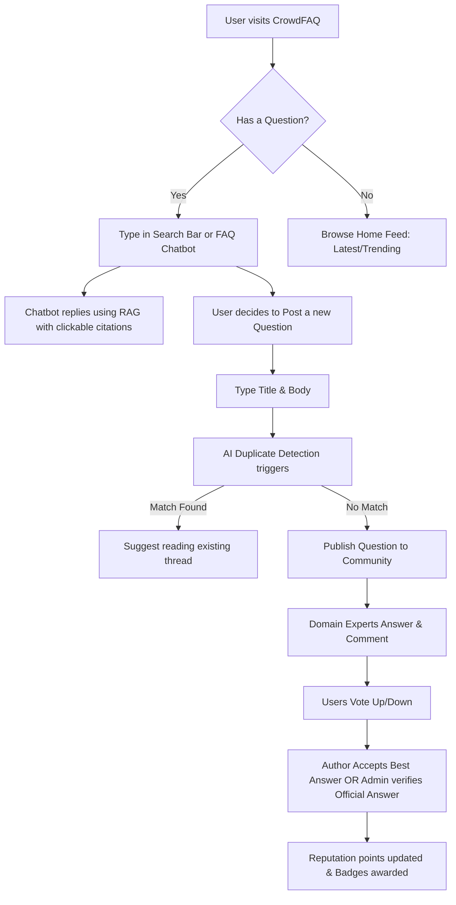

# CrowdFAQ Product Specification

CrowdFAQ is a crowdsourced FAQ and community Q&A portal designed to streamline developer support, reduce redundant questions, and capture collective knowledge. It combines a React TypeScript frontend, an Express API, MongoDB, and Gemini-powered vector search.

---

## 1. Product Vision & Goals

Every growing technical community or engineering team suffers from **support fatigue**—answering the same questions (e.g., *"How do we rotate AWS keys without downtime?"*, *"How do I configure my local database?"*) repeatedly across Slack, emails, or chat threads. 

CrowdFAQ solves this by:
*   **Centralizing Knowledge**: A single public/private repository of high-fidelity Q&As and FAQs.
*   **Empowering the Community**: Gamifying knowledge sharing so users ask, answer, and moderate content together.
*   **Integrating Smart AI**: Surfacing answers proactively using vector-based semantic search and an interactive RAG assistant.
*   **Verifying Authority**: Allowing domain experts and admins to lock and mark official verified answers.

---

## 2. Target Personas

### 👤 Standard Community Member (The Seeker)
*   **Goal**: Find high-quality answers to technical or platform-related questions instantly.
*   **Pain Point**: Frustrated by search engines that match exact keywords rather than semantic intent, leading to duplicate posts or outdated answers.
*   **Key Action**: Queries the Q&A database, interacts with the FAQ chatbot, votes on helpful answers, and flags spam.

### 🏆 Domain Expert / Active Contributor (The Helper)
*   **Goal**: Build professional reputation, share expertise, and help peers.
*   **Pain Point**: Contributions in chat apps (like Slack) are transient and quickly buried.
*   **Key Action**: Answers open questions, writes detailed long-form answers, and earns badges for their achievements.

### 🛡️ Moderator & Admin (The Curator)
*   **Goal**: Maintain content quality, verify official replies, and remove malicious or incorrect posts.
*   **Pain Point**: Manual moderation of duplicate threads and spam takes too much time.
*   **Key Action**: Views stats, changes user roles, approves/rejects content reports, and marks answers as "Official."

---

## 3. Core Product Features

### 🔍 Semantic Search & Triage
*   **Smart Duplicate Checker**: When a user types a new question, the system runs a real-time semantic check (`POST /ai/check-duplicates`) against existing questions. It displays similar questions before the user can publish, preventing duplicate clutter.
*   **Vector Search**: Allows searching for conceptual matches (e.g., searching for "kubernetes secrets" returns CSI driver and Secret configuration Q&As even if the terms don't match exactly).

### 🤖 AI FAQ Assistant (RAG Chatbot)
*   **Premium Interactive Chat**: A persistent chatbot widget styled with a premium green-slate aesthetic.
*   **RAG Engine**: Retrieves the top relevant Q&A threads and platform knowledge documents, passes them to a language model (Gemini/Groq), and returns a precise answer.
*   **Clickable Citations**: Includes links (e.g., `[Source 1]`) that redirect the user directly to the question detail thread (`/q/:slug`).

### 💬 Thread Discussions & Collapsible Comments
*   **Nested Comments**: Standard members can comment on both questions and answers to request clarifications or suggest edits.
*   **Collapsible Comments Toggle**: To prevent visual clutter when threads have numerous comments, discussions are collapsed by default. Users can toggle them visible using the "Show Comments" action button.
*   **Content Flagging**: Users can report inappropriate questions or answers. Reports are queued dynamically in the moderator panel for approval, rejection, or deletion.
*   **Official Verification**: Admins can tag an answer as "Official," pinning it to the top of the question thread with a special checkmark badge.

### 🔔 Notifications & Subscriptions
*   **Real-time Alerts (Socket.IO)**: Real-time notification socket push events are triggered whenever:
    *   A new answer is posted to a followed question.
    *   An answer is marked as the "Best Answer."
    *   An answer is marked as "Faculty Verified" or "Official."
    *   A question's moderation status is updated.
*   **Inbox Panel**: Users can view all historical notifications, clear individual alerts, and mark them as read (`/notifications`).
*   **Question Following & Bookmarking**: Users can click the "Follow" button on any question thread to subscribe to notifications, and click the "Save" (Bookmark) button to pin it to their active dashboard feeds.

### 🎮 Gamification & Badges
*   **Dynamic Reputation**: Users earn reputation points based on upvotes, accepted answers, and general activity.
*   **Earned Badges**: Recalculated dynamically on the fly and persisted to MongoDB:
    *   *Early Adopter*: Assigned if the user is among the first 1,000 members created.
    *   *Storyteller*: Earned by contributing a detailed, comprehensive answer of over 500 words.
    *   *Curator*: Assigned for editing or moderating substantial platform content.
    *   *Mentor*: Earned for contributing 50+ answers.
    *   *Sleuth*: Earned for resolving 5+ reported moderation issues.
    *   *founder*: Automatically granted to accounts with the `admin` role.
    *   *verified*: Automatically granted to accounts designated as verified system or faculty accounts.

---

## 4. User Interaction Flows

---

## 5. Product Roadmap (Future Scope)

*   **Phase 1 (Completed)**: Core Q&A, comments, flagging/moderation dashboard, dynamic badges, and RAG chatbot with citations.
*   **Phase 2 (Next)**:
    *   **Slack/Discord Integration**: A bot that listens to Slack questions and answers them directly using CrowdFAQ's RAG database.
    *   **Email Digests**: Weekly personalized summaries of trending questions in followed categories.
    *   **Rich Text Editor**: Support for Markdown, syntax highlighting, and code block formatting in question bodies and comments.
