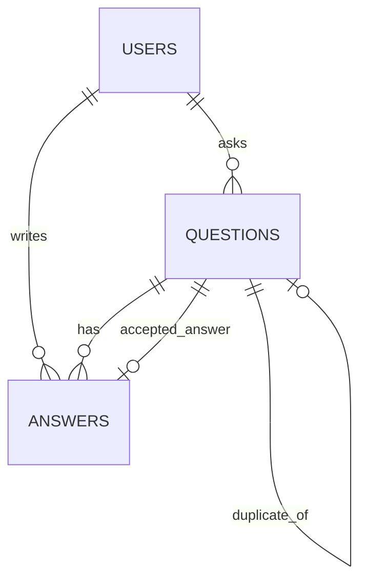

# CrowdFAQ Database Guide

This document describes the current MongoDB and Mongoose database design used by the CrowdFAQ backend.

The actual source of truth for schema details is:

```text
backend/models/User.js
backend/models/Question.js
backend/models/Answer.js
backend/services/aiService.js
backend/seed.js
```

## Database Stack

- Database: MongoDB or MongoDB Atlas
- ODM: Mongoose
- Backend: Node.js + Express
- AI search: Gemini embeddings with MongoDB Atlas Vector Search

## Current Collections

The current backend uses three main collections:

```text
users
questions
answers
```

Current relationship:



## User Model

Collection:

```text
users
```

Current fields:

| Field | Type | Notes |
|---|---|---|
| `displayName` | String | Required, 2-80 chars |
| `email` | String | Required, unique, indexed |
| `passwordHash` | String | Required, excluded from query results by default |
| `role` | String | `student`, `moderator`, or `admin` |
| `reputationScore` | Number | Defaults to `0` |
| `badges` | String array | Defaults to `[]` |
| `streak` | Number | Defaults to `0` |
| `createdAt` | Date | Added by timestamps |
| `updatedAt` | Date | Added by timestamps |

Current role values:

```text
student
moderator
admin
```

Moderation-relevant user field:

```text
role
```

## Question Model

Collection:

```text
questions
```

Current fields:

| Field | Type | Notes |
|---|---|---|
| `title` | String | Required, 8-180 chars |
| `body` | String | Required, 10-5000 chars |
| `author` | ObjectId | References `User`, required, indexed |
| `tags` | String array | Indexed |
| `embedding` | Number array | Optional, expected length `768` when present |
| `duplicateOf` | ObjectId | References another `Question`, optional |
| `acceptedAnswerId` | ObjectId | References `Answer`, optional |
| `upvoteCount` | Number | Defaults to `0` |
| `downvoteCount` | Number | Defaults to `0` |
| `duplicateScore` | Number | Optional value from `0` to `1` |
| `status` | String | Indexed |
| `createdAt` | Date | Added by timestamps |
| `updatedAt` | Date | Added by timestamps |

Current question status values:

```text
pending
answered
verified
resolved
duplicate
closed
```

Current indexes:

```js
questionSchema.index({ createdAt: -1, _id: -1 });
```

Important built-in indexes from schema fields:

```text
author
tags
duplicateOf
acceptedAnswerId
status
```

Virtual relationship:

```text
Question.answers -> Answer documents where Answer.question equals Question._id
```

## Answer Model

Collection:

```text
answers
```

Current fields:

| Field | Type | Notes |
|---|---|---|
| `question` | ObjectId | References `Question`, required, indexed |
| `author` | ObjectId | References `User`, optional, indexed |
| `body` | String | Required, 2-5000 chars |
| `aiGenerated` | Boolean | Defaults to `false`, indexed |
| `isAccepted` | Boolean | Defaults to `false`, indexed |
| `isOfficial` | Boolean | Defaults to `false`, indexed |
| `upvoteCount` | Number | Defaults to `0` |
| `downvoteCount` | Number | Defaults to `0` |
| `upvotedBy` | ObjectId array | Hidden from normal queries, used to prevent duplicate upvotes |
| `downvotedBy` | ObjectId array | Hidden from normal queries, used to prevent duplicate downvotes |
| `createdAt` | Date | Added by timestamps |
| `updatedAt` | Date | Added by timestamps |

Virtual field:

```text
netVoteScore = upvoteCount - downvoteCount
```

Current index:

```js
answerSchema.index({ question: 1, createdAt: 1 });
```

## Search And Embeddings

The backend uses Gemini embeddings for semantic search.

Current embedding model:

```text
gemini-embedding-001
```

Current expected embedding dimensions:

```text
768
```

The backend stores the embedding on each question:

```text
Question.embedding
```

When Gemini is unavailable or no API key is configured, the current search controller falls back to text search behavior where possible.

## MongoDB Atlas Vector Search

If using MongoDB Atlas Vector Search, create a vector index on the `questions` collection.

Recommended index name:

```text
vector_index
```

Recommended configuration for the current backend:

```json
{
  "fields": [
    {
      "type": "vector",
      "path": "embedding",
      "numDimensions": 768,
      "similarity": "cosine"
    }
  ]
}
```

The search controller currently queries:

```js
{
  $vectorSearch: {
    index: "vector_index",
    path: "embedding",
    queryVector: embedding,
    numCandidates: 100,
    limit: 5
  }
}
```

## Seed Script

The current seed script is:

```text
backend/seed.js
```

There is currently no `seed` script in `backend/package.json`, so run it directly:

```powershell
cd backend
node seed.js
```

## Current API Areas Using The Database

Authentication and users:

```text
POST /api/v1/auth/register
POST /api/v1/auth/login
POST /api/v1/auth/logout
GET  /api/v1/auth/me
PATCH /api/v1/users/me
GET  /api/v1/users/:id
GET  /api/v1/users/:id/questions
GET  /api/v1/users/:id/answers
```

Questions:

```text
GET  /api/v1/questions
POST /api/v1/questions
GET  /api/v1/questions/:id
```

Answers:

```text
POST  /api/v1/answers
PATCH /api/v1/answers/:id
DELETE /api/v1/answers/:id
PATCH /api/v1/answers/:id/accept
POST  /api/v1/answers/:id/vote
POST  /api/v1/answers/official/create
```

Admin moderation:

```text
GET    /api/v1/admin/stats
GET    /api/v1/admin/users
PATCH  /api/v1/admin/users/:id/role
GET    /api/v1/admin/questions
PATCH  /api/v1/admin/questions/:id/status
DELETE /api/v1/admin/questions/:id
GET    /api/v1/admin/answers
PATCH  /api/v1/admin/answers/:id/official
DELETE /api/v1/admin/answers/:id
```

Search:

```text
GET /api/v1/search?q=...
```

## Recommended Next Database Improvements

These are not fully implemented yet, but they are good next steps.

### Improve Authentication Fields

For production auth, improve:

```text
emailVerified
lastLoginAt
```

### Improve Official Answer Metadata

Current official answers use `Answer.isOfficial`. For richer admin history, add:

```text
Answer.officialSource
Answer.verifiedBy
Answer.verifiedAt
```

### Add Categories

Current tags are strings. Categories can be added later:

```text
categories
```

Suggested fields:

```text
name
slug
description
createdAt
updatedAt
```

### Add Notifications

Useful for real-time and user engagement:

```text
notifications
```

Suggested fields:

```text
user
title
body
type
isRead
referenceType
referenceId
createdAt
```

### Add Reports And Moderation

Useful for admin workflows:

```text
reports
```

Suggested fields:

```text
reporter
targetType
targetId
reason
details
status
resolvedBy
resolvedAt
createdAt
```

## Team Guidance

For team development, use these files as ownership boundaries:

```text
Auth/User member:
  backend/models/User.js

Questions member:
  backend/models/Question.js

Answers member:
  backend/models/Answer.js

Search/AI member:
  backend/services/aiService.js
  Question.embedding

Admin/QA member:
  seed data, indexes, docs, moderation-related future models
```

Avoid creating separate MongoDB connections in feature files. The backend should share one database connection through server startup/config.
