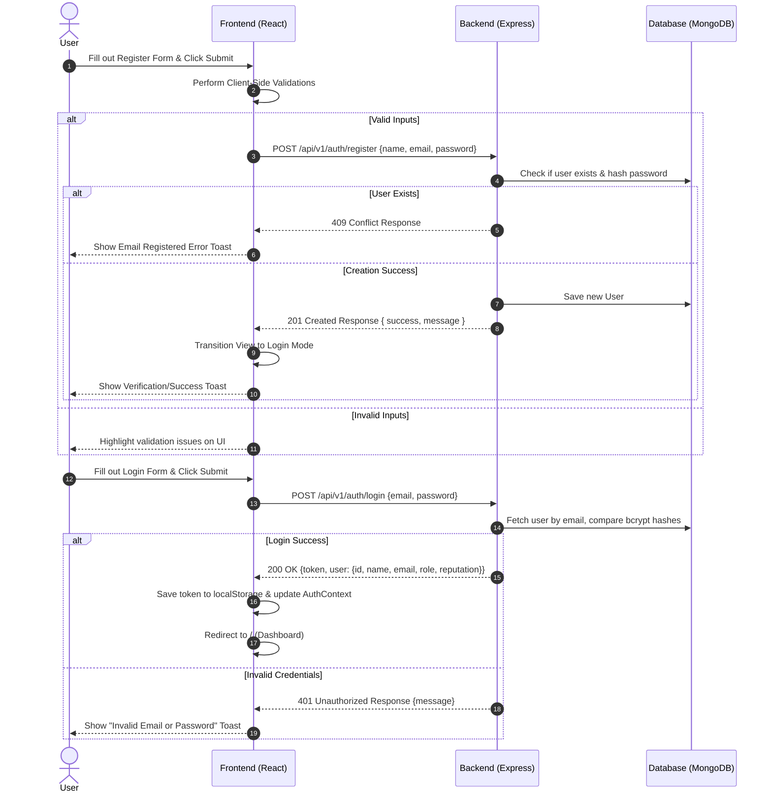
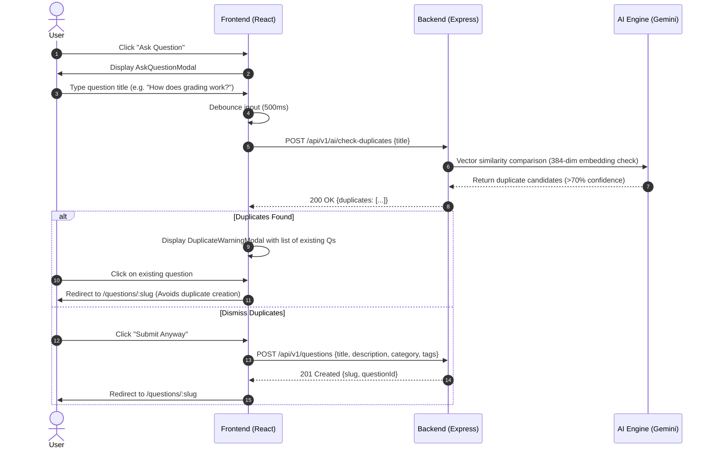
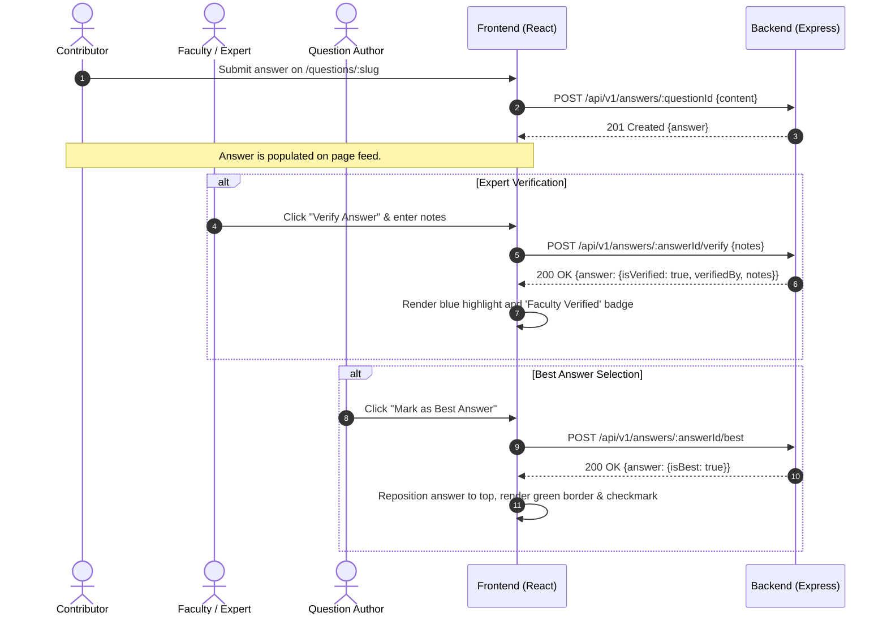

# Software Requirement Specification (SRS)
## Frontend Functional Outline & API Contracts

This specification document outlines the routing, user flows, components, validation rules, and API request/response contracts for the frontend application of the **CrowdFAQ** platform. It is designed to serve as a contract between the Frontend Team (Team A) and the Backend Team (Team B) and AI/QA Team (Team C).

---

## 1. System Routes & Routing Architecture

The CrowdFAQ application is a Single Page Application (SPA) utilizing React Router. The table below lists all routes, access levels, and associated views.

| Route Path | Page Name | Auth Required | Allowed Roles | Primary Components |
|:---|:---|:---:|:---|:---|
| `/auth` | Authentication Page | No | All (Guests only) | `LoginCard`, `SignUpCard`, `ForgotPasswordCard`, `ResetPasswordCard` |
| `/` | Dashboard | Yes | All Users | `QuestionFeed`, `Sidebar`, `CategoryFilter`, `TagCloud`, `AskQuestionModal` |
| `/questions/:slug` | Question Detail | Yes | All Users | `QuestionThread`, `AnswerList`, `AnswerForm`, `CommentBlock`, `RelatedQuestionsSidebar`, `AiSummaryCard`, `ChatBotPanel` |
| `/leaderboard` | Leaderboard | Yes | All Users | `LeaderboardTable`, `ReputationBreakdown`, `FilterTabs` |
| `/profile/:userId` | User Profile | Yes | All Users | `UserProfileHeader`, `ActivityHeatmap`, `BadgesList`, `EditProfileModal` |
| `/admin` | Admin Dashboard | Yes | Admin, Moderator | `ReportLogTable`, `CategoryCrudList`, `UserManagementList` |

### Route Protection Logic
* **Authenticated Routes**: Handled via `ProtectedRoute.jsx`. Reads user context. If no token is stored in `localStorage`, the user is redirected to `/auth` with the current path stored in state to facilitate redirect-after-login.
* **Role-Based Access**: The `/admin` route checks the user's role in the global `AuthContext`. Users lacking `'Admin'` or `'Moderator'` roles are redirected to `/` with a "403 Forbidden" toast notification.

---

## 2. Interactive User Flows

Below are the text-based workflow sequences demonstrating the frontend-backend communication steps.

### 2.1 Registration & Authentication Flow


### 2.2 Question Creation with Real-time AI Duplicate Detection


### 2.3 Answer, Verification, & Best Answer Flow


---

## 3. Page-by-Page Specifications

### 3.1 Authentication Page
* **Page Name**: Authentication Page (`/auth`)
* **Purpose**: Allows users to register accounts, log in, trigger password recovery requests, and perform password resets.
* **Frontend Inputs**: 
  * Registration: `name` (text), `email` (text), `password` (password), `confirmPassword` (password)
  * Login: `email` (text), `password` (password), `rememberMe` (checkbox)
  * Forgot Password: `email` (text)
  * Reset Password: `password` (password), `confirmPassword` (password)
* **Frontend Actions**: Submit registration form, submit login form, submit forgot password request, submit password reset, and toggle between form card modes.
* **Data Sent To Backend**:
  * Register: `POST /api/v1/auth/register` with `{ name, email, password }`
  * Login: `POST /api/v1/auth/login` with `{ email, password }`
  * Forgot Password: `POST /api/v1/auth/forgot-password` with `{ email }`
  * Reset Password: `POST /api/v1/auth/reset-password` with `{ token, password }`
* **Expected Backend Response**:
  * Register (201 Created): `{ success: true, message: "User registered...", userId: "objectId" }`
  * Login (200 OK): `{ success: true, token: "JWT...", user: { id, name, email, role: { name }, reputation, profilePictureUrl } }`
  * Forgot Password (200 OK): `{ success: true, message: "Reset token sent..." }`
  * Reset Password (200 OK): `{ success: true, message: "Password reset success..." }`
* **Possible Errors**:
  * `400 Bad Request` (Email pattern mismatch, password strength validation failures, unmatched password confirmations).
  * `401 Unauthorized` (Wrong email/password combination on login).
  * `409 Conflict` (Email already registered under another account).
  * `500 Internal Server Error` (Database or mailing handler failure).

---

### 3.2 Dashboard
* **Page Name**: Dashboard (`/`)
* **Purpose**: Displays the central questions feed. Offers text search, category filters, tag navigation, sorting switches, and handles question creation.
* **Frontend Inputs**:
  * Feed Filters: `q` (text search), `category` (category select), `tag` (tag click), `sort` (select dropdown), `page` (navigation pagination)
  * Ask Question Form: `title` (text), `description` (markdown editor), `category` (dropdown selection ID), `tags` (comma-separated or chips list)
* **Frontend Actions**: Input search queries (debounced by 300ms), click category badges, select tag filters, change sorting dropdowns, click pagination steps, open question modal, trigger real-time AI duplicate checking, and submit questions.
* **Data Sent To Backend**:
  * Get Feed: `GET /api/v1/questions` with query params `?q=...&category=...&tag=...&sort=...&page=...&limit=...`
  * Create Question: `POST /api/v1/questions` with `{ title, description, category, tags }`
  * AI Duplicate Check: `POST /api/v1/ai/check-duplicates` with `{ title }`
* **Expected Backend Response**:
  * Get Feed (200 OK): `{ success: true, data: [ { id, title, slug, description, author: { id, name }, category: { id, name }, tags: [...], viewsCount, answersCount, votesCount, status, createdAt } ], pagination: { total, page, pages, limit } }`
  * Create Question (201 Created): `{ success: true, message: "Question created...", data: { id, slug } }`
  * AI Duplicate Check (200 OK): `{ success: true, duplicates: [ { id, title, slug, confidenceScore } ] }`
* **Possible Errors**:
  * `400 Bad Request` (Question title length < 15 chars, description < 30 chars, missing category, or exceeding max 5 tags limit).
  * `401 Unauthorized` (Session missing or invalid JWT bearer token when creating questions).
  * `500 Internal Server Error` (Database indexing or neural embedding server down).

---

### 3.3 Question Detail Page
* **Page Name**: Question Detail Page (`/questions/:slug`)
* **Purpose**: Displays a full question thread, including answers, voting tools, comment sections, related suggestions, AI summaries, and the AI chatbot sidebar.
* **Frontend Inputs**:
  * Vote System: Upvote/Downvote actions (click controls)
  * Subscription: Follow button (click toggle)
  * Post Answer Form: `content` (markdown editor)
  * Post Comment Form: `content` (text input)
  * Verify Answer Modal: `verificationNotes` (textarea)
  * AI Chatbot Window: `message` (text input)
* **Frontend Actions**: Vote on questions/answers, toggle following a question, submit answers, submit comments, mark best answers (creator only), verify answers (experts only), and submit AI chat messages.
* **Data Sent To Backend**:
  * Question Vote: `POST /api/v1/votes/questions/:id` with `{ voteType: "upvote" | "downvote" }`
  * Answer Vote: `POST /api/v1/votes/answers/:id` with `{ voteType: "upvote" | "downvote" }`
  * Post Answer: `POST /api/v1/answers/:questionId` with `{ content }`
  * Post Comment: `POST /api/v1/answers/:id/comments` or `POST /api/v1/questions/:id/comments` with `{ content }`
  * Mark Best Answer: `POST /api/v1/answers/:id/best` (no body)
  * Verify Answer: `POST /api/v1/answers/:id/verify` with `{ verificationNotes }`
  * AI Chat: `POST /api/v1/ai/chat` with `{ questionId, message }`
* **Expected Backend Response**:
  * Fetch Thread (200 OK): `{ success: true, data: { id, title, slug, description, author, category, tags, viewsCount, status, createdAt, votes: [...], answers: [ { id, content, isBest, isVerified, verifiedBy, verificationNotes, votes: [...], comments: [...], createdAt } ], relatedQuestions: [...] } }`
  * Post Answer (201 Created): `{ success: true, message: "Answer posted...", data: { id, content, isBest, isVerified, createdAt } }`
  * Cast Vote (200 OK): `{ success: true, votesCount, userVote }`
  * Verify Answer (200 OK): `{ success: true, message: "Answer verified...", data: { answerId, isVerified, verifiedBy, verificationNotes } }`
  * Mark Best Answer (200 OK): `{ success: true, data: { answerId, isBest: true } }`
  * AI Chat (200 OK): `{ success: true, reply: "AI text response..." }`
* **Possible Errors**:
  * `400 Bad Request` (Empty comment/answer content, missing required verification notes).
  * `401 Unauthorized` (Unauthenticated voting, posting, or verifying).
  * `403 Forbidden` (User attempting to mark best answer on a thread they do not own, or verifying without Expert/Faculty role).
  * `404 Not Found` (Target question slug, answer ID, or comment ID does not exist).
  * `500 Internal Server Error` (Vector query failing for related questions, Gemini API rate limits).

---

### 3.4 Gamification Leaderboard
* **Page Name**: Leaderboard Page (`/leaderboard`)
* **Purpose**: Displays community engagement rankings based on reputation scores across configurable time intervals.
* **Frontend Inputs**:
  * Filter Selection: Time window tabs (`daily`, `weekly`, `monthly`, `all-time`)
* **Frontend Actions**: Select filter window, click user row to navigate to profile.
* **Data Sent To Backend**:
  * Get Leaderboard: `GET /api/v1/users/leaderboard` with query parameter `?filter=daily|weekly|monthly|all-time`
* **Expected Backend Response**:
  * Get Leaderboard (200 OK): `{ success: true, leaderboard: [ { rank: 1, userId: "id", name: "Name", reputation: 120, isVerified: true, badgesCount: 5 } ] }`
* **Possible Errors**:
  * `400 Bad Request` (Invalid or unsupported filter parameter value).
  * `500 Internal Server Error`.

---

### 3.5 User Profile Page
* **Page Name**: User Profile Page (`/profile/:userId`)
* **Purpose**: Displays public user reputation, level, badges, activity logs, and, if authorized as the owner, profile update forms.
* **Frontend Inputs**:
  * Edit Profile: `name` (text), `avatar` (file input uploader)
  * Filter selection tabs (`questions`, `answers`)
* **Frontend Actions**: Toggle view tabs, click edit profile trigger, select avatar images, and submit changes.
* **Data Sent To Backend**:
  * Update Profile: `PUT /api/v1/users/me` with `multipart/form-data` containing keys `name` and/or `avatar`
* **Expected Backend Response**:
  * Get Profile (200 OK): `{ success: true, data: { id, name, reputation, isVerified, badges: [ { badgeId: { name, description, iconUrl }, awardedAt } ], activityMetrics: { questionsCount, answersCount } } }`
  * Update Profile (200 OK): `{ success: true, message: "Profile updated...", user: { id, name, profilePictureUrl } }`
* **Possible Errors**:
  * `400 Bad Request` (Invalid avatar file format, file size exceeding 2MB threshold).
  * `401 Unauthorized` (Token missing or expired when updating details).
  * `500 Internal Server Error` (Cloud storage or file processing error).

---

### 3.6 Admin/Moderator Dashboard
* **Page Name**: Admin Dashboard (`/admin`)
* **Purpose**: Moderation workspace to view flag logs, create categories, and configure user permissions.
* **Frontend Inputs**:
  * Flag Resolution: `action` (select: `dismissed` | `actioned`), `notes` (textarea)
  * User Role Assignment: `role` (select: `Admin` | `Moderator` | `Expert` | `User`)
  * Category Management: `name` (text), `slug` (text), `description` (textarea)
* **Frontend Actions**: Select resolution options, submit flag resolutions, change user roles, submit category creation forms, and delete categories.
* **Data Sent To Backend**:
  * Resolve Report: `POST /api/v1/moderation/reports/:id/resolve` with `{ action, notes }`
  * Update User Role: `PUT /api/v1/users/:id/role` with `{ roleName }`
  * Create Category: `POST /api/v1/categories` with `{ name, slug, description }`
  * Delete Category: `DELETE /api/v1/categories/:id`
* **Expected Backend Response**:
  * Get Reports (200 OK): `{ success: true, reports: [ { id, reporter: { id, name }, reportedType, targetId, reason, details, status, createdAt } ] }`
  * Resolve Report (200 OK): `{ success: true, message: "Report resolved..." }`
  * Update Role (200 OK): `{ success: true, message: "User role updated..." }`
  * Create Category (201 Created): `{ success: true, message: "Category created...", data: { id, name, slug } }`
  * Delete Category (200 OK): `{ success: true, message: "Category deleted..." }`
* **Possible Errors**:
  * `401 Unauthorized` (Caller has no valid security token).
  * `403 Forbidden` (User does not possess Admin or Moderator role permissions).
  * `409 Conflict` (Category name or slug matches an existing entry).
  * `500 Internal Server Error`.

---

## 4. API Request & Response Contracts

All request payloads, success answers, and expected failure structures are detailed below.
Base URL: `/api/v1`

### 4.1 Authentication Service (`/auth`)

#### 4.1.1 POST `/auth/register`
* **Purpose**: Register a new user account.
* **Request Header**: `Content-Type: application/json`
* **Request Body**:
```json
{
  "name": "Alex Mercer",
  "email": "alex.mercer@iit.edu",
  "password": "Password123!"
}
```
* **Success Response (201 Created)**:
```json
{
  "success": true,
  "message": "User registered successfully. Please verify your email.",
  "userId": "647f2b90df4a3233e08f51a2"
}
```
* **Errors**:
  * `400 Bad Request` (Validation Failed):
    ```json
    {
      "success": false,
      "message": "Validation Error",
      "errors": [
        { "field": "email", "message": "Must be a valid IIT email address." },
        { "field": "password", "message": "Password must be at least 8 characters and contain a number." }
      ]
    }
    ```
  * `409 Conflict` (Email Already Registered):
    ```json
    {
      "success": false,
      "message": "Email is already registered to another user."
    }
    ```

---

#### 4.1.2 POST `/auth/login`
* **Purpose**: Login user and return bearer token.
* **Request Header**: `Content-Type: application/json`
* **Request Body**:
```json
{
  "email": "alex.mercer@iit.edu",
  "password": "Password123!"
}
```
* **Success Response (200 OK)**:
```json
{
  "success": true,
  "token": "eyJhbGciOiJIUzI1NiIsInR5cCI6IkpXVCJ9.eyJpZCI6IjY0N2YyYjkwZGY0YTMyMzNlMDhmNTFhMiIsInJvbGUiOiJVc2VyIn0.signature",
  "user": {
    "id": "647f2b90df4a3233e08f51a2",
    "name": "Alex Mercer",
    "email": "alex.mercer@iit.edu",
    "role": {
      "name": "User",
      "description": "Standard community member"
    },
    "reputation": 120,
    "profilePictureUrl": "https://cdn.crowdfaq.edu/avatars/user-647f.png"
  }
}
```
* **Errors**:
  * `401 Unauthorized` (Invalid Credentials):
    ```json
    {
      "success": false,
      "message": "Invalid email or password."
    }
    ```

---

#### 4.1.3 POST `/auth/forgot-password`
* **Purpose**: Triggers password reset sequence.
* **Request Body**:
```json
{
  "email": "alex.mercer@iit.edu"
}
```
* **Success Response (200 OK)**:
```json
{
  "success": true,
  "message": "Password reset token sent to your email if an account exists."
}
```
* **Errors**:
  * `400 Bad Request` (Invalid Email Pattern):
    ```json
    {
      "success": false,
      "message": "Please enter a valid email address."
    }
    ```

---

#### 4.1.4 POST `/auth/reset-password`
* **Purpose**: Save new password using token.
* **Request Body**:
```json
{
  "token": "reset-token-received-in-email",
  "password": "NewStrongPassword456!"
}
```
* **Success Response (200 OK)**:
```json
{
  "success": true,
  "message": "Password has been reset successfully. You may now log in."
}
```
* **Errors**:
  * `400 Bad Request` (Invalid/Expired Token):
    ```json
    {
      "success": false,
      "message": "The reset token is invalid or has expired."
    }
    ```

---

### 4.2 Question Management (`/questions`)

#### 4.2.1 GET `/questions`
* **Purpose**: List questions with search, tagging, categories, and paginated sorting.
* **Query Params**:
  * `q` (string, optional)
  * `category` (slug string, optional)
  * `tag` (slug string, optional)
  * `sort` (`newest` | `votes` | `views` | `unresolved`)
  * `page` (number, default: 1)
  * `limit` (number, default: 10)
* **Success Response (200 OK)**:
```json
{
  "success": true,
  "data": [
    {
      "id": "647f2b90df4a3233e08f51b9",
      "title": "How does the grading curve work in CS401?",
      "slug": "how-does-the-grading-curve-work-in-cs401",
      "description": "I wanted to find out what percentage of students receive an A...",
      "author": {
        "id": "647f2b90df4a3233e08f51a2",
        "name": "Alex Mercer"
      },
      "category": {
        "id": "647f2b90df4a3233e08f5101",
        "name": "Academics"
      },
      "tags": [
        { "id": "647f2b90df4a3233e08f5202", "name": "grading" },
        { "id": "647f2b90df4a3233e08f5205", "name": "cs401" }
      ],
      "viewsCount": 154,
      "answersCount": 3,
      "votesCount": 14,
      "status": "open",
      "createdAt": "2026-06-11T12:00:00.000Z"
    }
  ],
  "pagination": {
    "total": 45,
    "page": 1,
    "pages": 5,
    "limit": 10
  }
}
```

---

#### 4.2.2 POST `/questions`
* **Purpose**: Create a new question thread.
* **Request Header**: `Authorization: Bearer <jwt_token>`
* **Request Body**:
```json
{
  "title": "How does the grading curve work in CS401?",
  "description": "I wanted to find out what percentage of students receive an A. Can anyone share past grade distributions?",
  "category": "647f2b90df4a3233e08f5101",
  "tags": ["grading", "cs401"]
}
```
* **Success Response (201 Created)**:
```json
{
  "success": true,
  "message": "Question created successfully.",
  "data": {
    "id": "647f2b90df4a3233e08f51b9",
    "slug": "how-does-the-grading-curve-work-in-cs401"
  }
}
```
* **Errors**:
  * `401 Unauthorized` (Token missing or expired)
  * `400 Bad Request` (Missing required parameters)

---

#### 4.2.3 GET `/questions/:slug`
* **Purpose**: Retrieve single question details, its full answers thread, comments, and related recommended questions.
* **Success Response (200 OK)**:
```json
{
  "success": true,
  "data": {
    "id": "647f2b90df4a3233e08f51b9",
    "title": "How does the grading curve work in CS401?",
    "slug": "how-does-the-grading-curve-work-in-cs401",
    "description": "I wanted to find out what percentage of students receive an A...",
    "author": {
      "id": "647f2b90df4a3233e08f51a2",
      "name": "Alex Mercer",
      "role": "User",
      "profilePictureUrl": "https://cdn.crowdfaq.edu/avatars/user-647f.png"
    },
    "category": {
      "id": "647f2b90df4a3233e08f5101",
      "name": "Academics"
    },
    "tags": [
      { "id": "647f2b90df4a3233e08f5202", "name": "grading" }
    ],
    "viewsCount": 155,
    "status": "open",
    "createdAt": "2026-06-11T12:00:00.000Z",
    "votes": [
      { "user": "647f2b90df4a3233e08f51a2", "voteType": "upvote" }
    ],
    "isFollowing": true,
    "answers": [
      {
        "id": "647f2c41df4a3233e08f53c1",
        "content": "Typically, the top 15% get an A. CS401 limits the curve...",
        "isBest": true,
        "isVerified": true,
        "verifiedBy": {
          "id": "647f2b90df4a3233e08f5109",
          "name": "Prof. Alan Turing"
        },
        "verificationNotes": "This aligns with the syllabus guidelines set for the Spring semester.",
        "votes": [
          { "user": "647f2b90df4a3233e08f5111", "voteType": "upvote" }
        ],
        "comments": [
          {
            "id": "647f2d80df4a3233e08f54b1",
            "author": {
              "id": "647f2b90df4a3233e08f5150",
              "name": "Jane Doe"
            },
            "content": "Thanks for the confirmation, Prof!",
            "createdAt": "2026-06-11T14:30:00.000Z"
          }
        ],
        "createdAt": "2026-06-11T13:10:00.000Z"
      }
    ],
    "relatedQuestions": [
      {
        "id": "647f2b90df4a3233e08f51c0",
        "title": "CS401 mid-term preparation notes",
        "slug": "cs401-mid-term-preparation-notes"
      }
    ]
  }
}
```

---

#### 4.2.4 PUT `/questions/:id`
* **Purpose**: Edit question body.
* **Request Header**: `Authorization: Bearer <jwt_token>`
* **Request Body**:
```json
{
  "title": "Updated Question Title",
  "description": "Updated description content with more details...",
  "category": "647f2b90df4a3233e08f5101",
  "tags": ["grading", "updated-tag"]
}
```
* **Success Response (200 OK)**:
```json
{
  "success": true,
  "message": "Question updated successfully."
}
```
* **Errors**:
  * `403 Forbidden` (Not owner or mod/admin)

---

#### 4.2.5 DELETE `/questions/:id`
* **Purpose**: Delete question.
* **Request Header**: `Authorization: Bearer <jwt_token>`
* **Success Response (200 OK)**:
```json
{
  "success": true,
  "message": "Question deleted successfully."
}
```

---

#### 4.2.6 POST `/questions/:id/follow`
* **Purpose**: Toggle updates subscription.
* **Request Header**: `Authorization: Bearer <jwt_token>`
* **Success Response (200 OK)**:
```json
{
  "success": true,
  "message": "Subscription updated successfully.",
  "isFollowing": true
}
```

---

### 4.3 Answer Management (`/answers`)

#### 4.3.1 POST `/answers/:questionId`
* **Purpose**: Write a new answer to a thread.
* **Request Header**: `Authorization: Bearer <jwt_token>`
* **Request Body**:
```json
{
  "content": "To get an A, you must average at least 92% after the final exam curve."
}
```
* **Success Response (201 Created)**:
```json
{
  "success": true,
  "message": "Answer posted successfully.",
  "data": {
    "id": "647f2c41df4a3233e08f53c1",
    "content": "To get an A, you must average at least 92% after the final exam curve.",
    "isBest": false,
    "isVerified": false,
    "createdAt": "2026-06-12T11:15:00.000Z"
  }
}
```

---

#### 4.3.2 POST `/answers/:id/best`
* **Purpose**: Mark selected answer as "Best Answer" (Authorized: Question Creator only).
* **Request Header**: `Authorization: Bearer <jwt_token>`
* **Success Response (200 OK)**:
```json
{
  "success": true,
  "message": "Marked as best answer. Reputations updated.",
  "data": {
    "answerId": "647f2c41df4a3233e08f53c1",
    "isBest": true
  }
}
```

---

#### 4.3.3 POST `/answers/:id/verify`
* **Purpose**: Endorse answer with Expert verification (Authorized: Experts/Faculty only).
* **Request Header**: `Authorization: Bearer <jwt_token>`
* **Request Body**:
```json
{
  "verificationNotes": "I confirm this is the official policy as stated in the CS401 syllabus."
}
```
* **Success Response (200 OK)**:
```json
{
  "success": true,
  "message": "Answer verified successfully.",
  "data": {
    "answerId": "647f2c41df4a3233e08f53c1",
    "isVerified": true,
    "verifiedBy": "647f2b90df4a3233e08f5109",
    "verificationNotes": "I confirm this is the official policy as stated in the CS401 syllabus."
  }
}
```
* **Errors**:
  * `403 Forbidden` (User does not possess Faculty or Expert role)

---

### 4.4 Voting System (`/votes`)

#### 4.4.1 POST `/votes/questions/:id`
* **Purpose**: Upvote or downvote a question.
* **Request Header**: `Authorization: Bearer <jwt_token>`
* **Request Body**:
```json
{
  "voteType": "upvote" 
}
```
*Note: Send same `voteType` again to remove/undo the vote.*
* **Success Response (200 OK)**:
```json
{
  "success": true,
  "votesCount": 15,
  "userVote": "upvote"
}
```

---

#### 4.4.2 POST `/votes/answers/:id`
* **Purpose**: Upvote or downvote an answer.
* **Request Header**: `Authorization: Bearer <jwt_token>`
* **Request Body**:
```json
{
  "voteType": "downvote"
}
```
* **Success Response (200 OK)**:
```json
{
  "success": true,
  "votesCount": -1,
  "userVote": "downvote"
}
```

---

### 4.5 Search & Filtering

*Search queries utilize the main GET `/questions` endpoint. Filtering logic relies on clean parameter parsing.*

* **Text Query**: `GET /api/v1/questions?q=grading` -> Searches title/description.
* **Semantic Vector Search**: Triggers automatically on backend via Atlas Vector Search when query results standard keywords match.
* **Tag Query**: `GET /api/v1/questions?tag=grading` -> Filters questions containing the tag.
* **Category Query**: `GET /api/v1/questions?category=academics` -> Filters questions within category.

---

### 4.6 Categories & Tags (`/categories`)

#### 4.6.1 GET `/categories`
* **Purpose**: Retrieve list of all available categories.
* **Success Response (200 OK)**:
```json
{
  "success": true,
  "data": [
    {
      "id": "647f2b90df4a3233e08f5101",
      "name": "Academics",
      "slug": "academics",
      "description": "Course details, grading parameters, syllabus inquiries."
    }
  ]
}
```

---

### 4.7 User Profile & Gamification (`/users`)

#### 4.7.1 GET `/users/me`
* **Purpose**: Return profile metrics of authenticated caller.
* **Request Header**: `Authorization: Bearer <jwt_token>`
* **Success Response (200 OK)**:
```json
{
  "success": true,
  "data": {
    "id": "647f2b90df4a3233e08f51a2",
    "name": "Alex Mercer",
    "email": "alex.mercer@iit.edu",
    "role": "User",
    "reputation": 120,
    "isVerified": false,
    "badges": [
      {
        "badgeId": {
          "name": "First Answer",
          "description": "Awarded for answering your first community query.",
          "iconUrl": "https://cdn.crowdfaq.edu/badges/first-answer.png"
        },
        "awardedAt": "2026-06-01T10:00:00.000Z"
      }
    ]
  }
}
```

---

#### 4.7.2 GET `/users/profile/:userId`
* **Purpose**: View public statistics.
* **Success Response (200 OK)**:
```json
{
  "success": true,
  "data": {
    "id": "647f2b90df4a3233e08f51a2",
    "name": "Alex Mercer",
    "reputation": 120,
    "isVerified": false,
    "badges": [
      {
        "badgeId": {
          "name": "First Answer",
          "iconUrl": "https://cdn.crowdfaq.edu/badges/first-answer.png"
        }
      }
    ],
    "activityMetrics": {
      "questionsCount": 8,
      "answersCount": 15
    }
  }
}
```

---

#### 4.7.3 GET `/users/leaderboard`
* **Purpose**: Retrieve community leaderboard ranks.
* **Query Params**: `filter` (`daily` | `weekly` | `monthly` | `all-time`)
* **Success Response (200 OK)**:
```json
{
  "success": true,
  "leaderboard": [
    {
      "rank": 1,
      "userId": "647f2b90df4a3233e08f5109",
      "name": "Prof. Alan Turing",
      "reputation": 2450,
      "isVerified": true,
      "badgesCount": 12
    }
  ]
}
```

---

### 4.8 Notification System (`/notifications`)

#### 4.8.1 GET `/notifications`
* **Purpose**: Fetch notifications for logged-in user (usually polled at 30-second intervals or managed via WebSocket connections).
* **Request Header**: `Authorization: Bearer <jwt_token>`
* **Success Response (200 OK)**:
```json
{
  "success": true,
  "data": [
    {
      "id": "647f2f11df4a3233e08f55e2",
      "title": "New Answer Posted",
      "content": "Prof. Alan Turing answered your question about CS401 grading curve.",
      "type": "new_answer",
      "isRead": false,
      "referenceUrl": "/questions/how-does-the-grading-curve-work-in-cs401",
      "createdAt": "2026-06-12T11:10:00.000Z"
    }
  ]
}
```

---

#### 4.8.2 PUT `/notifications/:id/read`
* **Purpose**: Mark a notification as read.
* **Request Header**: `Authorization: Bearer <jwt_token>`
* **Success Response (200 OK)**:
```json
{
  "success": true,
  "message": "Notification marked as read."
}
```

---

### 4.9 Admin & Moderation Operations (`/moderation`)

#### 4.9.1 POST `/moderation/report`
* **Purpose**: Flag spam or offensive posts.
* **Request Header**: `Authorization: Bearer <jwt_token>`
* **Request Body**:
```json
{
  "reportedType": "answer",
  "targetId": "647f2c41df4a3233e08f53c1",
  "reason": "offensive",
  "details": "This post contains insulting language directed at another user."
}
```
* **Success Response (201 Created)**:
```json
{
  "success": true,
  "message": "Content successfully flagged. Moderators will review shortly."
}
```

---

#### 4.9.2 GET `/moderation/reports`
* **Purpose**: List pending logs flagged for review (Authorized: Admins/Moderators only).
* **Request Header**: `Authorization: Bearer <jwt_token>`
* **Success Response (200 OK)**:
```json
{
  "success": true,
  "reports": [
    {
      "id": "647f3110df4a3233e08f56fa",
      "reporter": {
        "id": "647f2b90df4a3233e08f5150",
        "name": "Jane Doe"
      },
      "reportedType": "answer",
      "targetId": "647f2c41df4a3233e08f53c1",
      "reason": "offensive",
      "details": "This post contains insulting language directed at another user.",
      "status": "pending",
      "createdAt": "2026-06-12T11:05:00.000Z"
    }
  ]
}
```

---

#### 4.9.3 POST `/moderation/reports/:id/resolve`
* **Purpose**: Resolve report log (Authorized: Admins/Moderators only).
* **Request Header**: `Authorization: Bearer <jwt_token>`
* **Request Body**:
```json
{
  "action": "actioned", 
  "notes": "Deleted offensive reply and warned creator."
}
```
*Note: action must be `'dismissed'` or `'actioned'`.*
* **Success Response (200 OK)**:
```json
{
  "success": true,
  "message": "Report successfully resolved."
}
```

---

### 4.10 AI Integration Features (`/ai`)

#### 4.10.1 POST `/ai/check-duplicates`
* **Purpose**: Validate if similar questions exist while typing the title (Auto-triggered when title length > 15).
* **Request Header**: `Authorization: Bearer <jwt_token>`
* **Request Body**:
```json
{
  "title": "Grading rules in CS401"
}
```
* **Success Response (200 OK)**:
```json
{
  "success": true,
  "duplicates": [
    {
      "id": "647f2b90df4a3233e08f51b9",
      "title": "How does the grading curve work in CS401?",
      "slug": "how-does-the-grading-curve-work-in-cs401",
      "confidenceScore": 0.89
    }
  ]
}
```

---

#### 4.10.2 GET `/ai/summarize/:questionId`
* **Purpose**: Summarize all posted answers for a question to give a quick overview.
* **Request Header**: `Authorization: Bearer <jwt_token>`
* **Success Response (200 OK)**:
```json
{
  "success": true,
  "summary": "CS401 curves grading according to a fixed scale where only the top 15% can receive an A grade. However, assignments are normalized, and students averaging 92%+ after final exams are guaranteed A grades."
}
```

---

#### 4.10.3 POST `/ai/chat`
* **Purpose**: Context-aware AI chatbot assistant (reads context of active question thread).
* **Request Header**: `Authorization: Bearer <jwt_token>`
* **Request Body**:
```json
{
  "questionId": "647f2b90df4a3233e08f51b9",
  "message": "Is there a textbook required for this class?"
}
```
* **Success Response (200 OK)**:
```json
{
  "success": true,
  "reply": "According to community comments and responses in this thread, CS401 uses 'Introduction to Algorithms' (CLRS 3rd Edition) as the primary textbook, but it is not strictly required for exam preparation."
}
```

---

## 5. Security & Error Response Mapping

The frontend handles general server anomalies gracefully. All requests passing through the custom Axios client will intercept non-2xx statuses and display standard alerts or actions.

### 5.1 Common HTTP Status Map

| Status Code | Client Action | Toast Display Message |
|:---:|:---|:---|
| **400** | Retain inputs and highlight errors | "Invalid inputs. Please verify your details." |
| **401** | Redirect to `/auth` & clear local tokens | "Session expired. Please log in again." |
| **403** | Prevent action & redirect back | "You do not have permission to execute this operation." |
| **404** | Display custom Not Found Screen | "The requested resource could not be found." |
| **409** | Display form field conflict | "Resource already exists." |
| **500** | Log error & display fallback screen | "Internal Server Error. Our team has been notified." |

### 5.2 Error Response Schema Contract
The backend agrees to return error lists in the following format:
```json
{
  "success": false,
  "message": "Brief description of error trigger",
  "errors": [
    {
      "field": "name_of_input_field",
      "message": "Detailed field validation error description"
    }
  ]
}
```
If the error is global (e.g. database failure or route error), `errors` will be empty, and `message` will contain the main issue description.
