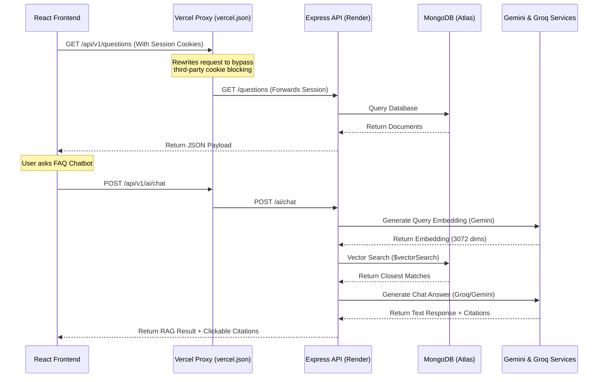

# CrowdFAQ Project Specification & Collaboration Guide

This document defines the engineering setup, sub-team collaboration boundaries, data flow rules, and QA practices for developers working on the CrowdFAQ platform.

---

## 1. Team Organization & Scope of Work

The engineering team is split into three main sub-teams, operating with clear interfaces:

| Sub-Team | Focus Area | Key Responsibilities | Primary Code Location |
| :--- | :--- | :--- | :--- |
| **Team A**<br>(Frontend) | Client Interface | React components, TypeScript integration, layout styling, analytics charts. | `/frontend` |
| **Team B**<br>(Backend) | Core API & DB | User sessions, CRUD endpoints, moderation API, Socket.IO config, Mongoose schemas. | `/backend` |
| **Team C**<br>(AI & QA) | Smart Tools & Tests | Gemini embedding scripts, Groq RAG pipelines, duplicate detection algorithms, Jest test suites. | `/backend/services`, `/backend/tests`, `/backend/scripts` |

---

## 2. Technical Architecture & Data Flow



### 🔑 Security & Cookie Exchange Invariant
The backend uses **HTTP-Only secure cookies** for JWT storage. 
*   All frontend API calls are routed through a shared Axios client in `frontend/src/lib/api.ts` with `withCredentials: true`.
*   During deployment, the Vercel reverse proxy rewrites `/api/:path*` to the Render backend, keeping the domain first-party so modern browsers do not block cookie storage.

### 🌐 API Endpoint Outline
All request paths use the `/api/v1` prefix:
*   **Authentication (`/auth`)**: `POST /auth/register` (user signup), `POST /auth/login` (session token generation), `GET /auth/me` (session recovery/badge sync).
*   **Questions (`/questions`)**: `GET /questions` (list feed/category/tags), `POST /questions` (submit question), `GET /questions/:slug` (details/slug lookups), `POST /questions/:id/follow` (subscription toggle).
*   **Answers & Votes (`/answers`, `/votes`)**: `POST /answers/:questionId` (submit answer), `POST /answers/:id/best` (select best answer), `POST /answers/:id/verify` (faculty verification), `POST /votes/questions/:id` & `POST /votes/answers/:id` (voting).
*   **Comments & Reports (`/comments`, `/reports`)**: `POST /questions/:id/comments` & `POST /answers/:id/comments` (submit comments), `POST /reports` (flag content).
*   **Notifications (`/notifications`)**: `GET /notifications` (retrieve notifications), `PATCH /notifications/:id/read` (mark notifications as read).
*   **Admin Console (`/admin`)**: `GET /admin/stats` (analytics metrics), `GET /admin/reports` (reported logs), `PATCH /admin/reports/:id` (approve/reject flags), `PUT /admin/users/:id/role` (role management).

### 🔌 Socket.IO Real-Time Event Bridge
The system bridges internal Mongoose events (via controllers) to Socket.IO connections (configured under `backend/config/socket.js` and `backend/server.js`):
*   `answer:created` ──► `new_answer` (Fires to question followers).
*   `answer:best` ──► `answer_accepted` (Notifies answer author).
*   `answer:verified` ──► `official_answer_created` (Announces faculty verified answer).
*   `question:moderated` ──► `question_status_updated` (Triggers status updates across active feeds).
*   **Client Connection**: Frontend establishes connections using `socket.io-client` pointing to the reverse-proxied host URL.

### 🛡️ Route Access Protection
*   **ProtectedRoute**: Wrap pages requiring auth (`Home`, `UserProfile`, `AskQuestion`, `Notifications`). Checks user context in React.
*   **Role-Based Access (Admin/Moderator)**: Access to `/admin/*` dashboards checks the `role` attribute inside `AuthContext`. Non-privileged users (role `'User'` or `'student'`) are blocked and redirected with a toast warning.

---

## 3. Developer Environment Setup

Follow these commands to spin up the local development environment:

### Backend Setup
```bash
cd backend
npm install
# Ensure MongoDB is running locally (mongodb://localhost:27017)
# Create .env with MONGODB_URI, JWT_SECRET, PORT=5000, and GEMINI_API_KEY
npm run dev
```

### Frontend Setup
```bash
cd frontend
npm install --legacy-peer-deps
npm start
# Runs the development server on http://localhost:3000
```

### Seeding Database & Knowledge Base
To seed questions, answers, and the AI platform knowledge documents:
```bash
cd backend
node seed.js                  # Seeds mock Q&As
node scripts/seedKnowledge.js # Seeds RAG platform document vector embeddings
```

---

## 4. Verification & Testing Protocols

All developers must run verification checks before pushing code.

### Backend Jest Tests
The backend contains comprehensive unit and integration tests.
```bash
cd backend
npm test
```
*   **Safety Invariant**: The test runs mock connection states. The badge calculation engine checks `process.env.NODE_ENV === "test"` and Mongoose connection status to skip DB queries during unit testing, avoiding buffering timeouts.

### Frontend TypeScript Checks & Builds
To ensure no type definitions are broken:
```bash
cd frontend
# Run TypeScript compile validation
npx tsc --noEmit
# Run production build compilation
npm run build
```

---

## 5. Development Code Invariants

Developers must keep these core code invariants intact:
1.  **Embeddings**: Schema validation in `Question.js` restricts embeddings to exactly **3072** elements. Changing models requires updates here.
2.  **ESLint useEffect Directives**: Bypassing react-hooks dependency warnings (e.g., `// eslint-disable-next-line react-hooks/exhaustive-deps`) must be written **directly above** the `useEffect` statement to comply with Vercel compile checks (which treat warnings as errors).
3.  **Mock-Free Views**: All components must fetch dynamically from the API; mocks in `mockData.ts` are deprecated.
