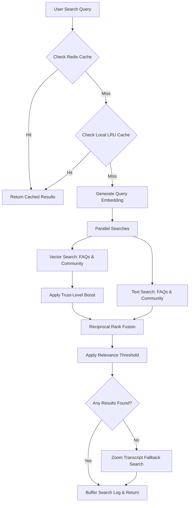

# Search and Embeddings

The platform uses a hybrid search engine that combines traditional keyword indexing with semantic vector search. By merging these two approaches, the search is resilient to typos and specific terminology (via keyword search) while being able to understand intent and conceptual relationships (via vector search).

---

## The Search Pipeline

When a user searches the Q&A portal, the query is executed through a multi-stage search pipeline:



---

## Key Pipeline Components

### 1. Two-Tier Semantic Caching
To minimize API embedding costs and MongoDB execution overhead:
- **First Tier (Redis)**: Shared across all api-server instances for distributed caching.
- **Second Tier (Local LRU Cache)**: Local node process memory cache (max 500 items, 1-hour TTL) for instant retrieval.

### 2. Parallel Search Queries
If the query is a cache miss, the system generates a vector embedding. It then executes four queries in parallel across two collections (`yaksha_faq_faqs` and `yaksha_faq_communityposts`):
- Vector search on FAQs.
- Vector search on Community Posts.
- Keyword text search on FAQs.
- Keyword text search on Community Posts.

### 3. Trust-Level Boosting
Vector search matches are boosted in relevance depending on their verified source authority:
- **High** (`high` — Official verified FAQs): Score receives a `+0.15` boost.
- **Expert** (`expert` — Admin-approved posts): Score receives a `+0.07` boost.
- **Medium** (`medium` — Community-approved posts): Score receives a `+0.02` boost.
- **Low** (Standard community content): No boost.

### 4. Reciprocal Rank Fusion (RRF)
RRF merges the rankings from keyword and vector searches. RRF assigns a score based on a document's position in both search results rather than their raw scores:
$$RRF\_Score(d) = \sum_{m \in M} \frac{1}{k + r_m(d)}$$
Where $M$ is the set of search algorithms (vector and text), $r_m(d)$ is the rank of document $d$ in search $m$, and $k$ is a constant (typically 60) that dampens the influence of high-ranking outliers.

### 5. Zoom Transcript Knowledge Fallback
If the FAQ and community collections yield no results meeting the relevance threshold, the system queries the Zoom transcript database (`KnowledgeBase` collection). This offers a zero-human-effort search layer directly from auto-processed lectures.

---

## MongoDB Atlas Index Definitions

To run hybrid search, the following index definitions must be configured in MongoDB:

### 1. Vector Search Index (`vector_index`)
This index must be defined on both the `faqs` and `communityposts` collections.
- **Field**: `embedding`
- **Dimensions**: Match your embedding provider (e.g., `1536` for OpenAI `text-embedding-3-small` or `384` for local `all-MiniLM-L6-v2`).
- **Similarity Metric**: `cosine`

*Atlas JSON Configuration:*
```json
{
  "mappings": {
    "dynamic": true,
    "fields": {
      "embedding": {
        "dimensions": 1536,
        "similarity": "cosine",
        "type": "knnVector"
      }
    }
  }
}
```

### 2. Full-Text Index
Traditional text search requires a text index on text fields.
- **FAQ Collection**: Question, Answer, and Category fields.
- **Community Posts**: Title, Body, and Category fields.

---

## Log Buffering and Metrics

High-traffic deployments can suffer database write bottlenecks from tracking analytics. The search engine resolves this by buffering logs:
- Log entries are held in memory and written to MongoDB in bulk every **5 seconds** or when the buffer reaches **50 entries**.
- Graceful shutdown handlers trigger an immediate flush to prevent log loss during restarts or scaling events.
- Search requests, latencies, and cache-hit metrics are tracked and exposed for Prometheus monitoring.
