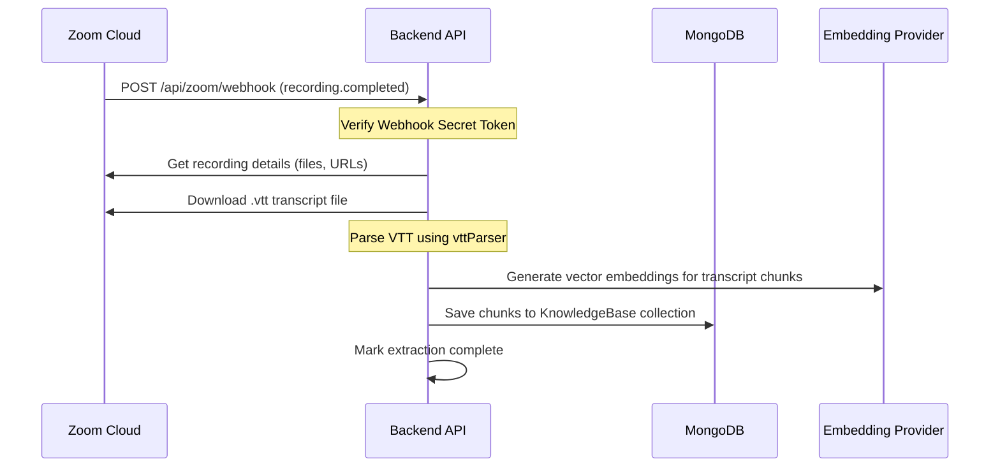

# Zoom Integration

The Zoom integration allows the platform to automatically ingest cloud recordings and transcripts (VTT files) of Zoom meetings, courses, or lectures. These transcripts are parsed, split into logical speaker chunks, embedded using vector models, and indexed in the FAQ database to enable AI-powered Q&A for students.

---

## Configuration Modes

Similar to the Discord integration, Zoom credentials can be set globally or per-program:

### 1. Global System Credentials
Set the Zoom API application details in `apps/backend/.env`:

| Variable | Description |
|----------|-------------|
| `ZOOM_CLIENT_ID` | Client ID from the Zoom App Marketplace. |
| `ZOOM_CLIENT_SECRET` | Client Secret from the Zoom App Marketplace. |
| `ZOOM_REDIRECT_URI` | Callback endpoint, e.g., `https://example.com/csfaq/api/zoom/auth/callback`. |
| `ZOOM_WEBHOOK_SECRET_TOKEN` | Verification token provided by Zoom to authorize incoming webhooks. |

### 2. Per-Program Zoom Settings (Dynamic)
In multi-tenant setups, each batch/cohort can connect to a different Zoom account. Admins configure this in **Admin -> Programs -> Program Settings -> Zoom Settings**:
- **Zoom Client ID** & **Client Secret**
- **Webhook Secret Token**
- **Redirect URI override** (if necessary)

Tokens are encrypted at rest using AES-256-GCM. The runtime attempts to resolve the credentials for the specific batch, falling back to the global env variables if no per-program settings exist.

---

## Zoom Marketplace App Configuration

To set up the integration, you must register a **Server-to-Server OAuth** or **User-Managed OAuth** app in the [Zoom App Marketplace](https://marketplace.zoom.us/):

1. **OAuth Scopes**:
   - `meeting:read:admin` / `meeting:read` (Read meeting info)
   - `recording:read:admin` / `recording:read` (Download recordings and transcripts)
2. **Redirect URL**: Add your public server callback URL:
   - `https://yourdomain.com/csfaq/api/zoom/auth/callback`
3. **Event Subscriptions**: Enable Event Subscriptions and check the following event:
   - **Recording**: `All-page Cloud Recording completed` (Sends webhook when transcripts are ready)
4. **Secret Token**: Copy the **Verification Token** / **Secret Token** and paste it into `ZOOM_WEBHOOK_SECRET_TOKEN` (or the program Zoom config).

---

## Webhook and Ingestion Workflow

When a meeting ends and the recording finishes processing on Zoom:

### 1. Webhook Verification
The backend receives a webhook at `/csfaq/api/zoom/webhook`. It verifies the request signature using the `ZOOM_WEBHOOK_SECRET_TOKEN`. If verification fails, the webhook is immediately rejected with a `401 Unauthorized` status.

### 2. Transcript Downloading & Parsing (`vttParser`)
The system identifies the `.vtt` file in the recording files list. It downloads the file and parses the WebVTT structure, extracting:
- Timestamps (start and end)
- Speaker names (if identified by Zoom)
- Text contents

### 3. Chunking & Indexing
The parsed text is split into chunks (roughly 500–1000 characters) with overlapping windows to preserve context. Each chunk is passed to the configured AI Embedding Provider to generate a vector representation, which is saved as a searchable document scoped to the specific `batchId`.

---

## Troubleshooting

### Webhooks are Ignored or Returning 401
1. Verify that `ZOOM_WEBHOOK_SECRET_TOKEN` is configured and matches the "Verification Token" in your Zoom App Feature dashboard.
2. Note that Zoom periodically sends a `challenge` request (URL validation) to verify the webhook endpoint. The backend automatically handles this challenge and returns the encrypted challenge token in response.

### Transcripts Not Being Processed
1. Ensure **Cloud Recording Transcripts** is enabled in your Zoom account settings. If Zoom only records video and audio without generating subtitles/VTT, the bot will find no files to ingest.
2. Verify that the Zoom OAuth token has the necessary `recording:read` scope.
3. Check the backend logs for **Circuit Breaker Open** messages. If the Zoom API suffers repeated failures (e.g. rate limits or server errors), the backend opens the Zoom circuit breaker, temporarily blocking Zoom API requests to prevent backend thread starvation. It automatically resets after 30 seconds of healthy status.
